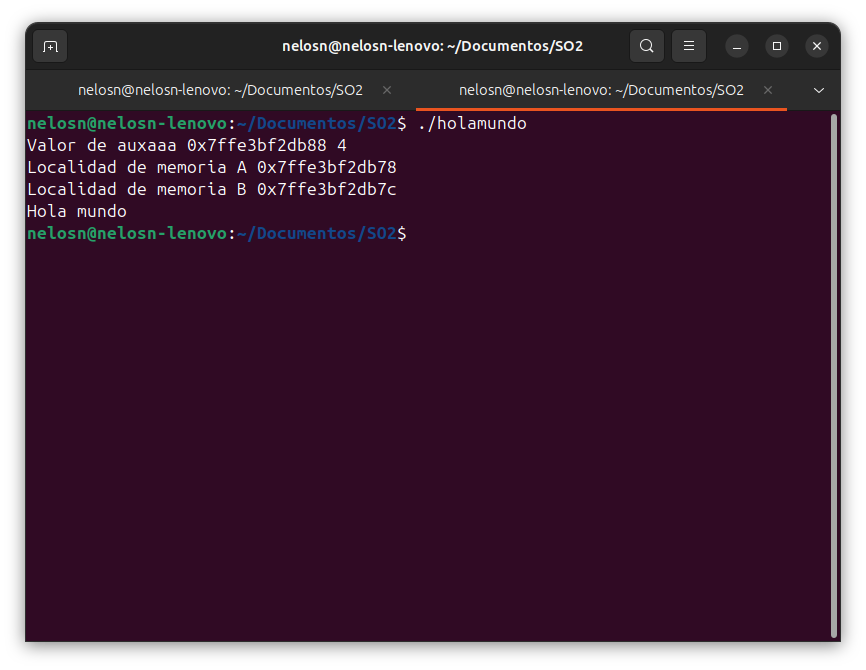
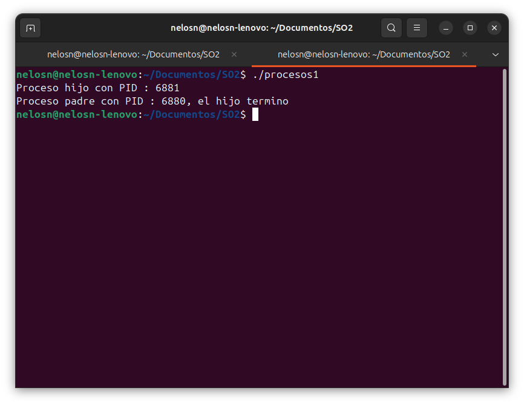
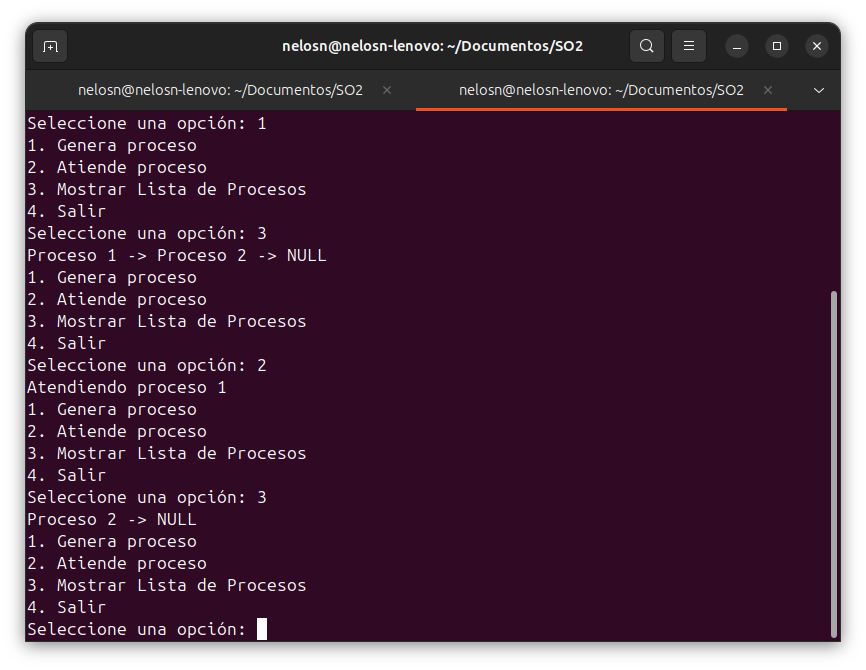
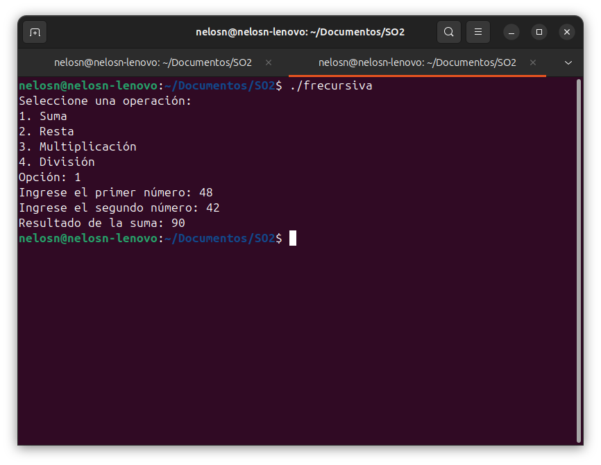
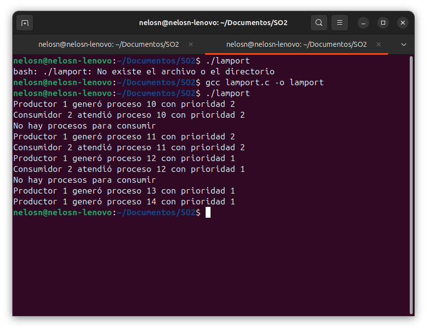
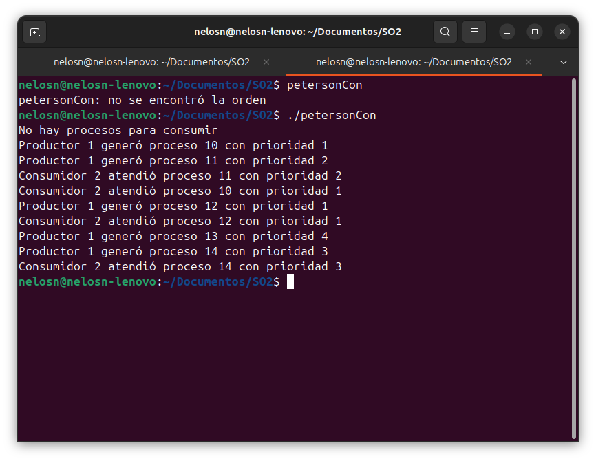
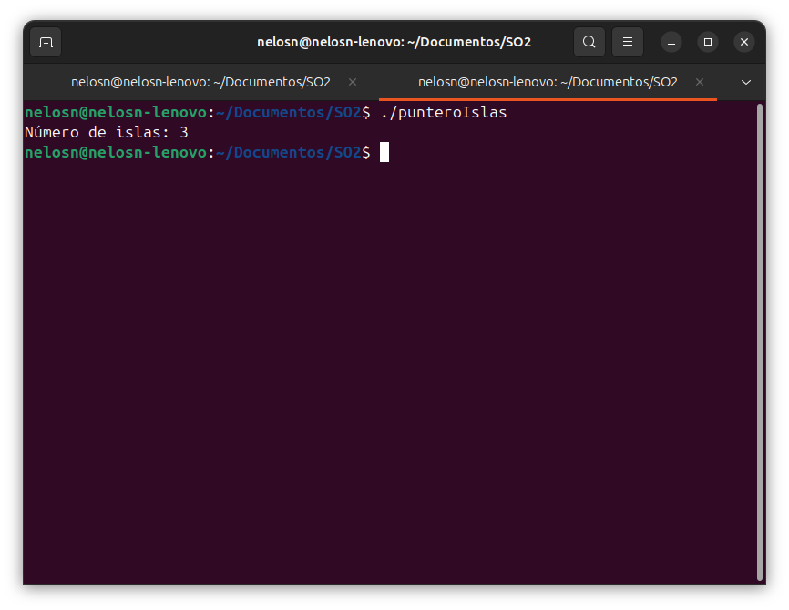
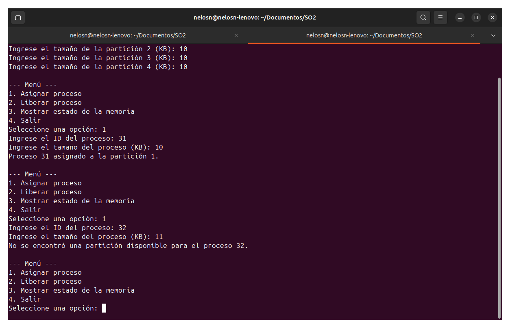
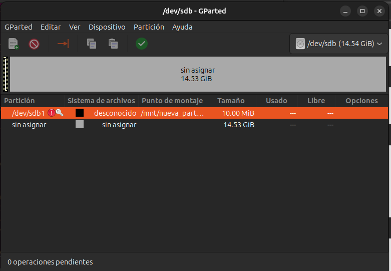

# Mi Repositorio 

[Repositorio en GitHub](https://github.com/nelelizalde24/SO_Apuntes.git)

## Índice

- [Mi Repositorio](#mi-repositorio)
  - [Índice](#índice)
    - [Hola Mundo](#hola-mundo)
    - [Proceso 1](#proceso-1)
    - [Cola de Prioridad](#cola-de-prioridad)
    - [Funciones Recursiva](#funciones-recursiva)
    - [Hilos](#hilos)
    - [Peterson Consumidor](#peterson-consumidor)
    - [Punteros con Islas](#punteros-con-islas)
    - [Simulacion de Particiones](#simulacion-de-particiones)
    - [Problema de los Filósofos](#problema-de-los-filósofos)
    - [Actividad](#actividad)
      - [**OBJETIVO**](#objetivo)
      - [**¿Qué se espera de ti?**](#qué-se-espera-de-ti)
      - [**Administración de Memoria**](#administración-de-memoria)
      - [**Administración de Entrada/Salida**](#administración-de-entradasalida)
    - [Actividades: Dispositivos de entrada y salida en Linux](#actividades-dispositivos-de-entrada-y-salida-en-linux)
    - [Comandos de Entrada y Salida, Discos y Archivos](#comandos-de-entrada-y-salida-discos-y-archivos)

### Hola Mundo 

```c 
#include <stdio.h>

int main (){
  
  int a = 4,b = 3;
  int *auxa, **auxaa, ***auxaaa;
  
  auxa = &a; ///Le da la direccion de memoria que tiene a y se la da a guardar al auxaa
  auxaa = &auxa;
  auxaaa = &auxaa;
  
  printf("Valor de auxaaa %p %d \n" , auxaaa , ***auxaaa);
  printf("Localidad de memoria A %p \n" ,&a);
  printf("Localidad de memoria B %p \n" ,&b);
  printf("Hola mundo \n");
  

return 0;

}
```
[Ejecuta el programa aquí](https://ideone.com)



### Proceso 1

```c
#include <stdio.h>
#include <unistd.h>
#include <sys/wait.h>

int main() {
    
    pid_t pid = fork();
    
    if(pid == 0){
       
       //Proceso hijo
       printf("Proceso hijo con PID : %d\n" , getpid());
       
    }else {
        //Proceso padre
        wait(NULL); //Esperar a que el proceso hijo termine
        printf("Proceso padre con PID : %d, el hijo termino \n", getpid());
    }
    
    return 0;
    
}
```
[Ejecuta el programa aquí](https://ideone.com)



### Cola de Prioridad 

```c
#include <stdio.h>
#include <stdlib.h>
#include <time.h>

typedef struct _nodo {
    int valor;
    struct _nodo *siguiente;
} nodo;

// Genera un nuevo proceso con un identificador único
nodo* genera_proceso() {
    static int contador = 1;
    nodo* nuevo = (nodo*)malloc(sizeof(nodo));
    if (nuevo == NULL) {
        printf("Error al asignar memoria.\n");
        exit(1);
    }
    nuevo->valor = contador++;
    nuevo->siguiente = NULL;
    return nuevo;
}

// Inserta un nuevo nodo al final de la lista
void insertar_final(nodo** cabeza) {
    nodo* nuevoNodo = genera_proceso();

    if (*cabeza == NULL) {
        *cabeza = nuevoNodo;
    } else {
        nodo* temp = *cabeza;
        while (temp->siguiente != NULL) {
            temp = temp->siguiente;
        }
        temp->siguiente = nuevoNodo;
    }
}

// Imprime la lista de procesos en orden
void imprimir_lista(nodo* cabeza) {
    nodo* temp = cabeza;
    while (temp != NULL) {
        printf("Proceso %d -> ", temp->valor);
        temp = temp->siguiente;
    }
    printf("NULL\n");
}

// Atiende el primer proceso en la cola y lo elimina de la lista
void atender_proceso(nodo** cabeza) {
    if (*cabeza == NULL) {
        printf("No hay procesos para atender.\n");
        return;
    }

    nodo* temp = *cabeza;
    printf("Atendiendo proceso %d\n", temp->valor);
    *cabeza = temp->siguiente;
    free(temp);
}

int main() {
    nodo* cabeza = NULL;
    int op = 0;

    do {
        printf("1. Genera proceso\n");
        printf("2. Atiende proceso\n");
        printf("3. Mostrar Lista de Procesos\n");
        printf("4. Salir\n");
        printf("Seleccione una opción: ");
        scanf("%d", &op);

        switch (op) {
            case 1:
                insertar_final(&cabeza);
                break;
            case 2:
                atender_proceso(&cabeza);
                break;
            case 3:
                imprimir_lista(cabeza);
                break;
            case 4:
                printf("Saliendo...\n");
                break;
            default:
                printf("Opción no válida\n");
        }
    } while (op != 4);

    return 0;
}
```
[Ejecuta el programa aquí](https://ideone.com)



### Funciones Recursiva

``` c 
#include <stdio.h>
#include <unistd.h>
#include <sys/wait.h>

// Función para la multiplicación usando solo incrementos y decrementos en un proceso hijo
int multiplicacion(int a, int b) {
    int resultado = 0;

    // Añadimos 'a' a 'resultado' en 'b' iteraciones
    for (int i = 0; i < b; i++) {
        int temp = a;
        while (temp > 0) { // Incrementamos resultado mientras temp decrementa a 0
            resultado++;
            temp--;
        }
    }
    return resultado;
}

// Función para la división usando solo incrementos y decrementos en un proceso hijo
int division(int a, int b) {
    if (b == 0) {
        printf("Error: División por cero.\n");
        return -1;
    }

    int cociente = 0;
    while (a >= b) { // Restamos 'b' de 'a' hasta que 'a' sea menor que 'b'
        int temp = b;
        while (temp > 0) {
            a--;
            temp--;
        }
        cociente++;
    }
    return cociente;
}

int main() {
    int opcion, a, b, resultado;
    pid_t pid;

    printf("Seleccione una operación:\n");
    printf("1. Multiplicación\n");
    printf("2. División\n");
    printf("Opción: ");
    scanf("%d", &opcion);

    printf("Ingrese el primer número: ");
    scanf("%d", &a);
    printf("Ingrese el segundo número: ");
    scanf("%d", &b);

    if (opcion == 1 || opcion == 2) {
        pid = fork(); // Crea un proceso hijo

        if (pid < 0) {
            printf("Error al crear el proceso.\n");
            return 1;
        }

        if (pid == 0) {  // Proceso hijo
            if (opcion == 1) {
                resultado = multiplicacion(a, b);
                printf("Resultado de la multiplicación: %d\n", resultado);
            } else if (opcion == 2) {
                resultado = division(a, b);
                printf("Resultado de la división: %d\n", resultado);
            }
            _exit(0); // Salir del proceso hijo
        } else { // Proceso padre
            wait(NULL); // Espera a que el proceso hijo termine
        }
    } else {
        printf("Opción inválida.\n");
    }

    return 0;
}

```
[Ejecuta el programa aquí](https://ideone.com)


### Hilos 

```c
#include <stdio.h> 
#include <stdlib.h>
#include <pthread.h>
#include <unistd.h>

#define MAX_PROCESOS 10

typedef struct _nodo {
    int valor;
    int prioridad;
    struct _nodo *siguiente;
} nodo;

nodo* cabeza = NULL;

int turno[2];
int eligiendo[2] = {0, 0};

int numero_aleatorio() {
    return (rand() % 4) + 1;
}

nodo* genera_proceso(int id) {
    nodo* nuevo = (nodo*)malloc(sizeof(nodo));
    nuevo->valor = id;
    nuevo->prioridad = numero_aleatorio();
    nuevo->siguiente = NULL;
    return nuevo;
}

int max_turno() {
    return turno[0] > turno[1] ? turno[0] : turno[1];
}

void* productor(void* arg) {
    int id = *(int*)arg;
    for (int i = 0; i < 5; i++) {
        eligiendo[0] = 1;
        turno[0] = max_turno() + 1;
        eligiendo[0] = 0;

        while (eligiendo[1]);
        while (turno[1] != 0 && (turno[1] < turno[0] || (turno[1] == turno[0] && 1 < 0)));

        nodo* nuevo = genera_proceso(id * 10 + i);
        nuevo->siguiente = cabeza;
        cabeza = nuevo;
        printf("Productor %d generó proceso %d con prioridad %d\n", id, nuevo->valor, nuevo->prioridad);

        turno[0] = 0;
        sleep(1);
    }
    return NULL;
}

void* consumidor(void* arg) {
    int id = *(int*)arg;
    for (int i = 0; i < 5; i++) {
        eligiendo[1] = 1;
        turno[1] = max_turno() + 1;
        eligiendo[1] = 0;

        while (eligiendo[0]);
        while (turno[0] != 0 && (turno[0] < turno[1] || (turno[0] == turno[1] && 0 < 1)));

        if (cabeza != NULL) {
            nodo* temp = cabeza;
            cabeza = cabeza->siguiente;
            printf("Consumidor %d atendió proceso %d con prioridad %d\n", id, temp->valor, temp->prioridad);
            free(temp);
        } else {
            printf("No hay procesos para consumir\n");
        }

        turno[1] = 0;
        sleep(1);
    }
    return NULL;
}

int main() {
    srand(time(NULL));
    pthread_t hilo_productor, hilo_consumidor;
    int id_productor = 1, id_consumidor = 2;

    // Crear los hilos con los argumentos correctos
    pthread_create(&hilo_productor, NULL, productor, &id_productor);
    pthread_create(&hilo_consumidor, NULL, consumidor, &id_consumidor);

    pthread_join(hilo_productor, NULL);
    pthread_join(hilo_consumidor, NULL);

    return 0;
}


```
[Ejecuta el programa aquí](https://ideone.com)


### Peterson Consumidor

```c 
#include <stdio.h>
#include <stdlib.h>
#include <pthread.h>
#include <unistd.h>

#define MAX_PROCESOS 10

typedef struct _nodo {
    int valor;
    int prioridad;
    struct _nodo *siguiente;
} nodo;

nodo* cabeza = NULL;

int turno = 0;
int interesado[2] = {0, 0};
int numero_aleatorio() {

    return (rand() % 4) + 1;
}

nodo* genera_proceso(int id) {
    nodo* nuevo = (nodo*)malloc(sizeof(nodo));
    nuevo->valor = id;
    nuevo->prioridad = numero_aleatorio();
    nuevo->siguiente = NULL;
    return nuevo;
}

void* productor(void* arg) {
    int id = *(int*)arg;
    
    for (int i = 0; i < 5; i++) {
        interesado[0] = 1;
        turno = 1;
        
        while (interesado[1] && turno == 1);
        nodo* nuevo = genera_proceso(id * 10 + i);
        nuevo->siguiente = cabeza;
        cabeza = nuevo;
        printf("Productor %d generó proceso %d con prioridad %d\n", id, nuevo->valor, nuevo->prioridad);
        interesado[0] = 0;
        sleep(1);
    }
    return NULL;
}

void* consumidor(void* arg) {
    int id = *(int*)arg;
    for (int i = 0; i < 5; i++) {
        interesado[1] = 1;
        turno = 0;
        while (interesado[0] && turno == 0);

        if (cabeza != NULL) {
            nodo* temp = cabeza;
            cabeza = cabeza->siguiente;
            printf("Consumidor %d atendió proceso %d con prioridad %d\n", id, temp->valor, temp->prioridad);
            free(temp);

        } else {
            printf("No hay procesos para consumir\n");
        }

        interesado[1] = 0;
        sleep(1);
    }
    return NULL;
}

int main() {
    srand(time(NULL));
    pthread_t hilo_productor, hilo_consumidor;
    int id_productor = 1, id_consumidor = 2;

    pthread_create(&hilo_productor, NULL, productor, &id_productor);
    pthread_create(&hilo_consumidor, NULL, consumidor, &id_consumidor);

    pthread_join(hilo_productor, NULL);
    pthread_join(hilo_consumidor, NULL);

    return 0;
}


```
[Ejecuta el programa aquí](https://ideone.com)


### Punteros con Islas 

```c
#include <stdio.h>
#include <stdbool.h>

#define ROWS 6
#define COLS 8

// Movimientos para las 8 direcciones (horizontal, vertical, diagonal)
int rowDirs[] = {-1, -1, -1, 0, 0, 1, 1, 1};
int colDirs[] = {-1, 0, 1, -1, 1, -1, 0, 1};

// Comprueba si la posición (x, y) es válida
bool isValid(int x, int y, int visited[ROWS][COLS], int grid[ROWS][COLS]) {
    return (x >= 0 && x < ROWS && y >= 0 && y < COLS && grid[x][y] == 1 && !visited[x][y]);
}

// DFS para marcar todas las celdas conectadas como visitadas
void dfs(int x, int y, int visited[ROWS][COLS], int grid[ROWS][COLS]) {
    visited[x][y] = 1;
    for (int i = 0; i < 8; i++) {
        int newX = x + rowDirs[i];
        int newY = y + colDirs[i];
        if (isValid(newX, newY, visited, grid)) {
            dfs(newX, newY, visited, grid);
        }
    }
}

// Función para contar islas en la matriz
int countIslands(int grid[ROWS][COLS]) {
    int visited[ROWS][COLS] = {0};
    int count = 0;

    for (int i = 0; i < ROWS; i++) {
        for (int j = 0; j < COLS; j++) {
            if (grid[i][j] == 1 && !visited[i][j]) {
                dfs(i, j, visited, grid);
                count++;
            }
        }
    }
    return count;
}

int main() {
    int grid[ROWS][COLS] = {
        {0, 0, 0, 0, 0, 0, 0, 0},
        {0, 1, 1, 0, 0, 0, 0, 1},
        {0, 1, 1, 0, 0, 1, 0, 1},
        {0, 1, 1, 0, 0, 1, 0, 1},
        {0, 0, 0, 0, 1, 1, 0, 1},
        {0, 0, 0, 0, 0, 0, 0, 0}
    };

    printf("Número de islas: %d\n", countIslands(grid));

    return 0;
}

```
[Ejecuta el programa aquí](https://ideone.com)


### Simulacion de Particiones 

```c
#include <stdio.h>
#include <stdlib.h>
#include <string.h>

#define MAX_PARTICIONES 100
#define MAX_PROCESOS 100
                        ////////QUE FUNCIONES DINAMICAMENTE///////////
typedef struct {
    int tamano;
    int id_de_proceso; // -1 si el proceso no es asignado
} Particion;

void imprime_memoria(Particion Particions[], int numero_de_particiones) {
    printf("\nEstado de la memoria:\n");
    for (int i = 0; i < numero_de_particiones; i++) {
        if (Particions[i].id_de_proceso == -1) {
            printf("Partición %d: %d KB (Libre)\n", i + 1, Particions[i].tamano);
        } else {
            printf("Partición %d: %d KB (Proceso %d)\n", i + 1, Particions[i].tamano, Particions[i].id_de_proceso);
        }
    }
    printf("\n");
}

int main() {
    int memoria_total, numero_de_particiones;
    Particion Particions[MAX_PARTICIONES];

    // Solicitar tamaño total de la memoria
    printf("Ingrese el tamaño total de la memoria (KB): ");
    scanf("%d", &memoria_total);

    // Solicitar número de particiones
    printf("Ingrese el número de particiones: ");
    scanf("%d", &numero_de_particiones);

    if (numero_de_particiones > MAX_PARTICIONES) {
        printf("Número máximo de particiones excedido (%d).\n", MAX_PARTICIONES);
        return 1;
    }

    // Solicitar tamaños de las particiones
    int tamano_total_particion = 0;
    for (int i = 0; i < numero_de_particiones; i++) {
        printf("Ingrese el tamaño de la partición %d (KB): ", i + 1);
        scanf("%d", &Particions[i].tamano);
        Particions[i].id_de_proceso = -1; // Inicialmente, todas están libres
        tamano_total_particion += Particions[i].tamano;
    }

    if (tamano_total_particion > memoria_total) {
        printf("Error: El tamaño total de las particiones excede el tamaño de la memoria.\n");
        return 1;
    }

    int op;
    do {
        printf("\n--- Menú ---\n");
        printf("1. Asignar proceso\n");
        printf("2. Liberar proceso\n");
        printf("3. Mostrar estado de la memoria\n");
        printf("4. Salir\n");
        printf("Seleccione una opción: ");
        scanf("%d", &op);

        switch (op) {
            case 1: {
                int id_de_proceso, tam_proceso;
                printf("Ingrese el ID del proceso: ");
                scanf("%d", &id_de_proceso);
                printf("Ingrese el tamaño del proceso (KB): ");
                scanf("%d", &tam_proceso);

                int asignado = 0;
                for (int i = 0; i < numero_de_particiones; i++) {
                    if (Particions[i].id_de_proceso == -1 && Particions[i].tamano >= tam_proceso) {
                        Particions[i].id_de_proceso = id_de_proceso;
                        asignado = 1;
                        printf("Proceso %d asignado a la partición %d.\n", id_de_proceso, i + 1);
                        break;
                    }
                }
                if (!asignado) {
                    printf("No se encontró una partición disponible para el proceso %d.\n", id_de_proceso);
                }
                break;
            }
            case 2: {
                int id_de_proceso;
                printf("Ingrese el ID del proceso a liberar: ");
                scanf("%d", &id_de_proceso);

                int libre = 0;
                for (int i = 0; i < numero_de_particiones; i++) {
                    if (Particions[i].id_de_proceso == id_de_proceso) {
                        Particions[i].id_de_proceso = -1;
                        libre = 1;
                        printf("Proceso %d liberado de la partición %d.\n", id_de_proceso, i + 1);
                        break;
                    }
                }
                if (!libre) {
                    printf("No se encontró el proceso %d en ninguna partición.\n", id_de_proceso);
                }
                break;
            }
            case 3:
                imprime_memoria(Particions, numero_de_particiones);
                break;
            case 4:
                printf("Saliendo del programa.\n");
                break;
            default:
                printf("Opción no válida.\n");
        }
    } while (op != 4);

    return 0;
}

```
[Ejecuta el programa aquí](https://ideone.com)


---

### Problema de los Filósofos


Cinco filósofos se sientan alrededor de una mesa y pasan su vida cenando y pensando. Cada filósofo tiene un plato de fideos y un tenedor a la izquierda de su plato. Para comer los fideos son necesarios dos tenedores y cada filósofo sólo puede tomar los que están a su izquierda y derecha. Si cualquier filósofo toma un tenedor y el otro está ocupado, se quedará esperando, con el tenedor en la mano, hasta que pueda tomar el otro tenedor, para luego empezar a comer. Si dos filósofos adyacentes intentan tomar el mismo tenedor a una vez, se produce una condición de carrera: ambos compiten por tomar el mismo tenedor, y uno de ellos se queda sin comer. Si todos los filósofos toman el tenedor que está a su derecha al mismo tiempo, entonces todos se quedarán esperando eternamente, porque alguien debe liberar el tenedor que les falta. Nadie lo hará porque todos se encuentran en la misma situación (esperando que alguno deje sus tenedores). Entonces los filósofos se morirán de hambre. El problema consiste en encontrar un algoritmo que permita que los filósofos nunca se mueran de hambre.


---
### Actividad 

#### **OBJETIVO**

El objetivo de estas actividades es fortalecer tu comprensión de dos áreas
fundamentales en sistemas operativos: la administración de memoria y la
administración de entrada/salida (E/S). Estos conceptos son esenciales para
entender cómo un sistema operativo gestiona los recursos de hardware y soft-
ware para garantizar el funcionamiento eficiente de un equipo de cómputo.


#### **¿Qué se espera de ti?**

1. **Lectura y análisis crítico:**

   1.1 Antes de comenzar las actividades, revisa los temas relacionados
   en tu material de estudio o en recursos confiables. Asegúrate
   de comprender los conceptos clave, como memoria virtual, pagi-
   nación, dispositivos de bloque y planificación de discos.

   1.2 Reflexiona sobre cómo estos conceptos son aplicados en sistemas
   operativos modernos como Linux o Windows.

2. **Desarrollo práctico:**

    2.1 Implementarás programas en lenguajes como C o Python para
    simular y profundizar en los mecanismos estudiados. Esto in-
    cluye la creación de algoritmos de administración de memoria y
    simuladores de entrada/salida.

    2.2 Al realizar estas tareas, te familiarizarás con técnicas de pro-
    gramación orientadas a sistemas, como el manejo de memoria
    dinámica, la gestión de interrupciones y la planificación de recur-
    sos.

3. **Resolución de problemas:**

    3.1 Las actividades incluyen preguntas teóricas y prácticas diseñadas
    para retarte a analizar problemas reales y proponer soluciones
    innovadoras.

    3.2 Se espera que simules entornos de sistemas operativos y explores
    cómo interactúan sus componentes clave.


#### **Administración de Memoria**

1. **Política y filosofía**
   
    1.1 ¿Cuál es la diferencia entre fragmentación interna y    externa? Explica
    cómo cada una afecta el rendimiento de la memoria.

       Respuesta : 

    1.2 Investiga y explica las políticas de reemplazo de páginas en sistemas
    operativos. ¿Cuál consideras más eficiente y por qué?

       Respuesta : 

2. **Memoria real**
   
    2.1 Escribe un programa en C o Python que simule la administración de
    memoria mediante particiones fijas.

       Respuesta : 


    2.2 Diseña un algoritmo para calcular qué procesos pueden ser asignados
    a un sistema con memoria real limitada utilizando el algoritmo de
    "primera cabida".

       Respuesta : 

3. **Organización de memoria virtual**
   
    3.1 Investiga y explica el concepto de "paginación" y "segmentación".
    ¿Cuáles son las ventajas y desventajas de cada técnica?

       Respuesta : 


    3.2 Escribe un programa que simule una tabla de páginas para procesos
    con acceso aleatorio a memoria virtual.

       Respuesta : 

4. **Administración de memoria virtual**    

    
    4.1 IEscribe un código que implemente el algoritmo de reemplazo de página
    "Least Recently Used" (LRU).

        Respuesta : 


    4.2 Diseña un diagrama que represente el proceso de traducción de direc-
    ciones virtuales a físicas en un sistema con memoria virtual.

        Respuesta :

**Integración**

 1. Analiza un sistema operativo moderno (por ejemplo, Linux o Windows) e identifica cómo administra la memoria virtual.

        Respuesta :


 2. Realiza una simulación en cualquier lenguaje de programación que emule el swapping de procesos en memoria virtual.
        
        Respuesta :


#### **Administración de Entrada/Salida**

1. **Dispositivos y manejadores de dispositivos**
   
     1.1 Explica la diferencia entre dispositivos de bloque y dispositivos de
     carácter. Da un ejemplo de cada uno.

         Respuesta :

     1.2 Diseña un programa que implemente un manejador de dispositivos sen-
     cillo para un dispositivo virtual de entrada.

         Respuesta :


2. **Mecanismos y funciones de los manejadores de dispositivos**
   
     2.1 Investiga qué es la interrupción por E/S y cómo la administra el sis-
     tema operativo. Escribe un ejemplo en pseudocódigo para simular este
     proceso.  

          Respuesta :

    2.2 Escribe un programa que utilice el manejo de interrupciones en un
     sistema básico de simulación.

          Respuesta :

3.  **Estructuras de datos para manejo de dispositivos**
   
     3.1 Investiga y explica qué es una cola de E/S. Diseña una simulación de
     una cola con prioridad.

           Respuesta :

     3.2 Escribe un programa que simule las operaciones de un manejador de
     dispositivos utilizando una tabla de estructuras.

           Respuesta :

4. **Operaciones de Entrada/Salida**

     4.1 Diseña un flujo que describa el proceso de lectura de un archivo desde
     un disco magnético. Acompáñalo con un programa básico que simule
     el proceso.

           Respuesta :

     4.2 Implementa un programa en Python, C o java que realice operaciones
     de entrada/salida asíncronas usando archivos.

           Respuesta :

**Integración**

1. Escribe un programa que implemente el algoritmo de planificación de
discos "Elevator (SCAN)".

         Respuesta :

2. Diseña un sistema que maneje múltiples dispositivos simulados (disco
duro, impresora, teclado) y muestra cómo se realiza la comunicación
entre ellos.

         Respuesta :

**Avanzados**

1. Explica cómo los sistemas operativos modernos optimizan las opera-
ciones de entrada/salida con el uso de memoria caché.

         Respuesta :

---


### Actividades: Dispositivos de entrada y salida en Linux

- **Introducción**

En este ejercicio, aprenderá a listar, verificar y analizar los dispositivos de entrada y salida en Linux. Usarán comandos básicos y herramientas comunes disponibles en cualquier distribución.

- **Actividad 1: Listar dispositivos conectados**

1. Objetivo

Conocer los dispositivos de entrada y salida conectados al sistema.

2. Instrucciones

    1. Abra una terminal en su entorno Linux.
    2. Ejecute los siguientes comandos y anote sus observaciones:
        `lsblk`: Enumera los dispositivos de bloque.
        
        `lsusb`: Lista los dispositivos conectados a los puertos USB.
        
        `lspci`: Muestra los dispositivos conectados al bus PCI.
        
        `dmesg | grep usb`: Muestra los mensajes del kernel relacionados con dispositivos USB.
    3. Conteste:
        - ¿Qué tipos de dispositivos se muestran en la salida de `lsblk`?
            
              En resumen, los dispositivos listados son bucles (loop), discos físicos (disk), particiones (part), y un dispositivo de solo lectura (rom).

        - ¿Cuál es la diferencia entre `lsusb` y `lspci`?

              lsusb: Muestra periféricos externos.

              lspci: Muestra tarjetas de expansión y controladoras.

        - ¿Qué información adicional proporciona `dmesg | grep usb`?
  
               De echo el comando seria asi para que te deje dar permiso: sudo dmesg | grep usb

               El comando te proporciona un registro detallado de todos los eventos de interacción con dispositivos USB en el sistema, desde la detección hasta la manipulación del dispositivo (como el almacenamiento masivo).
               

- **Actividad 2: Verificar dispositivos de almacenamiento**

1. Objetivo

Aprender cómo identificar discos duros, particiones y su configuración.

2. Instrucciones

    1. Use el comando `fdisk -l` para listar todos los discos y particiones.
    2. Utilice `blkid` para ver los identificadores UUID y los tipos de sistema de archivos.
    3. Use `df -h` para listar los dispositivos montados y su espacio disponible.
    4. Conteste:
        - ¿Qué dispositivos de almacenamiento están conectados a su sistema?
        
              Dispositivo: /dev/sda (maquina virtual)

              Dispositivo: /dev/sdb (usb)

        - ¿Qué particiones están montadas actualmente?
        
               S.ficheros     Tamaño Usados  Disp Uso% Montado en
                tmpfs            391M   1,7M  390M   1% /run
                /dev/sda2         25G    15G  8,3G  65% /
                tmpfs            2,0G    40M  1,9G   2% /dev/shm
                tmpfs            5,0M   8,0K  5,0M   1% /run/lock
                tmpfs            391M   136K  391M   1% /run/user/1000
                /dev/sdb1         15G   6,6G  8,0G  45% /mnt/nueva_particion

        
        - ¿Qué tipo de sistemas de archivos se usan en las particiones?
  
              ext4 en las particiones de discos físicos (/dev/sda2 y /dev/sdb1).

              tmpfs en las particiones de espacio temporal en memoria.

- **Actividad 3: Explorar dispositivos de entrada**

1. Objetivo

Identificar dispositivos como teclados, ratones y cámaras.

2. Instrucciones

    1. Ejecute `cat /proc/bus/input/devices` para listar los dispositivos de entrada.
    2. Use `evtest` para monitorear eventos de dispositivos de entrada (requiere permisos de superusuario).
    3. Investigue los siguientes dispositivos:
        - Teclado
        - Mouse
        - Controladores USB adicionales
    4. Conteste:
        - ¿Qué eventos genera cada dispositivo al interactuar con ellos?
        
              Teclado: Generalmente genera eventos EV_KEY para las teclas presionadas y liberadas, y EV_SYN para sincronizar los eventos.
              Mouse: Genera eventos EV_REL (movimiento del puntero) y EV_KEY (clics de botones).
              Controladores USB adicionales: Pueden generar eventos EV_ABS (movimiento de ejes) y EV_KEY (presión de botones), dependiendo del tipo de controlador (por ejemplo, un gamepad).
        
        - ¿Cómo se identifican los dispositivos en `/proc/bus/input/devices`?

              Los dispositivos de entrada se identifican por el campo Name="...", que describe el dispositivo (por ejemplo, "USB Keyboard", "USB Mouse"). También puedes ver el campo Handlers=, que indica el tipo de controlador utilizado por el dispositivo (por ejemplo, kbd para un teclado o mouse para un ratón). Además, el campo Bus=... muestra el tipo de bus (por ejemplo, USB, PS/2).


**Actividad 4: Examinar dispositivos de salida**

1. Objetivo

Entender cómo identificar dispositivos de salida como monitores y tarjetas de sonido.

2. Instrucciones

    1. Use `xrandr` para listar las pantallas conectadas y sus resoluciones.
    2. Ejecute `aplay -l` para listar las tarjetas de sonido disponibles.
    3. Use `lsof /dev/snd/*` para ver qué procesos están utilizando la tarjeta de sonido.
    4. Conteste:
        - ¿Qué salidas de video están disponibles en su sistema?
        
              La salida de video disponible en tu sistema es Virtual-1, con una resolución actual de 1920x966. También tiene varias resoluciones adicionales disponibles, como 1280x960, 1152x864, 1024x768, etc.
        
        - ¿Qué dispositivos de sonido se detectaron?
        
              Se detectó la tarjeta de sonido Intel 82801AA-ICH, con el dispositivo Intel ICH.
        
        - ¿Qué procesos están usando la tarjeta de sonido?

               Los procesos que están utilizando la tarjeta de sonido son:

                pipewire (PID 2738), que está usando el dispositivo /dev/snd/seq.

                wireplumb (PID 2742), que está utilizando el dispositivo /dev/snd/controlC0.

**Actividad 5: Crear un script de resumen**

1. Objetivo

Automatizar la recopilación de información de dispositivos de entrada y salida.

2. Instrucciones

    1. Cree un archivo llamado `dispositivos.sh` y agregue el siguiente contenido: ```bash #!/bin/bash echo "Dispositivos de bloque:" lsblk echo "Dispositivos USB:" lsusb echo "Dispositivos PCI:" lspci echo "Dispositivos de entrada:" cat /proc/bus/input/devices echo "Salidas de video:" xrandr echo "Tarjetas de sonido:" aplay -l ```
    2. Ejecute el script usando `bash dispositivos.sh`.
    3. Modifique el script para guardar la salida en un archivo llamado `resumendispositivos.txt`.
    
         [resumendispositivos.txt](resumendispositivos.txt)
    
    4. Conteste:
        - ¿Qué ventajas tiene usar un script para recopilar esta información?
        
                Usar un script para recopilar esta información tiene varias ventajas:

                Automatización: Puedes ejecutar el script una y otra vez sin tener que escribir comandos manualmente cada vez, lo que ahorra tiempo.
                
                Repetibilidad: Si necesitas recopilar la misma información más tarde o en múltiples máquinas, puedes ejecutar el mismo script y obtener resultados consistentes.
                
                Almacenamiento de resultados: Puedes redirigir la salida del script a un archivo de texto, como hiciste con resumendispositivos.txt, lo que facilita el análisis posterior.
                
                Consistencia: No hay margen para olvidarse de ejecutar algún comando o cometer errores al escribir comandos manualmente.
        
        - ¿Qué cambios realizaría para personalizar el script?

                Para personalizar aún más el script, podrías realizar los siguientes cambios:

                Agregar más información: Si quieres más detalles sobre los dispositivos o servicios, puedes añadir más comandos al script, como lsusb -v para más detalles sobre los dispositivos USB o lscpu para información detallada sobre la CPU.
                
                Formatear la salida: Podrías agregar algunas instrucciones de formato, como encabezados más claros, para que los resultados sean más fáciles de leer, por ejemplo, usando echo "-----".
                
                Filtrar resultados: Si no te interesa la salida completa de algún comando, puedes usar grep para filtrar la información relevante. Por ejemplo, si solo te interesa ver las tarjetas de sonido activas, podrías usar aplay -l | grep -i "card" para filtrar las líneas que contienen "card".
                
                Agregar fecha al archivo: Si ejecutas el script con frecuencia, podrías agregar la fecha al nombre del archivo para no sobrescribir los resultados anteriores. Por ejemplo:
                echo "Información recopilada el $(date)" >> "resumendispositivos_$(date +'%Y%m%d_%H%M').txt"


**Actividad 6: Reflexión y discusión**

1. Objetivo

Analizar la importancia del manejo de dispositivos en sistemas Linux.

2. Instrucciones

    1. Reflexione sobre lo aprendido y discuta en equipo:
        - ¿Qué comando encontró más útil y por qué?
        - ¿Qué tan importante es conocer los dispositivos conectados al sistema?
        - ¿Cómo podrían estos conocimientos aplicarse en la administración de sistemas?

---


### Comandos de Entrada y Salida, Discos y Archivos

- ####  **Ejercicio 1: Montar y Desmontar Discos**

   - Objetivo: Aprender a montar y desmontar un dispositivo externo.
    Inserta una memoria USB en el sistema.

   - Encuentra el dispositivo usando el comando:

         lsblk

       o

         fdisk -l

    - Monta la memoria USB en un directorio, por ejemplo, `/mnt/usb`:

          sudo mount /dev/sdX1 /mnt/usb

    - Verifica que esté montado correctamente:

          df -h

    - Copia un archivo desde tu directorio personal al dispositivo USB:

          cp archivo.txt /mnt/usb/

    - Desmonta la memoria USB:

          sudo umount /mnt/usb

    - ***RESULTADO***

        `nelosn@nelosn-lenovo:~$ lsblk` "Veo mi dispositivo usb"

            NAME   MAJ:MIN RM   SIZE RO TYPE MOUNTPOINTS
            loop0    7:0    0     4K  1 loop /snap/bare/5
            loop1    7:1    0  73,9M  1 loop /snap/core22/1722
            loop2    7:2    0 270,7M  1 loop /snap/firefox/4259
            loop3    7:3    0  73,9M  1 loop /snap/core22/1663
            loop4    7:4    0   273M  1 loop /snap/firefox/5273
            loop5    7:5    0  11,1M  1 loop /snap/firmware-updater/147
            loop6    7:6    0  10,7M  1 loop /snap/firmware-updater/127
            loop7    7:7    0   497M  1 loop /snap/gnome-42-2204/141
            loop8    7:8    0 505,1M  1 loop /snap/gnome-42-2204/176
            loop9    7:9    0  91,7M  1 loop /snap/gtk-common-themes/1535
            loop10   7:10   0  10,7M  1 loop /snap/snap-store/1218
            loop11   7:11   0  12,2M  1 loop /snap/snap-store/1216
            loop12   7:12   0  38,8M  1 loop /snap/snapd/21759
            loop13   7:13   0  44,3M  1 loop /snap/snapd/23258
            loop14   7:14   0   476K  1 loop /snap/snapd-desktop-integration/157
            loop15   7:15   0   568K  1 loop /snap/snapd-desktop-integration/253
            sda      8:0    0    25G  0 disk 
            ├─sda1   8:1    0     1M  0 part 
            └─sda2   8:2    0    25G  0 part /var/snap/firefox/common/host-hunspell
                                            /
            sdb      8:16   1  14,5G  0 disk 
            └─sdb1   8:17   1  14,5G  0 part /media/nelosn/ESD-ISO
            sr0     11:0    1  1024M  0 rom  

        `nelosn@nelosn-lenovo:~$ sudo mount /dev/sdb1 /mnt/usb` "Monto la usb a un directorio"
            
        `nelosn@nelosn-lenovo:~$ df -h` "Veo mi usb se haya montado bien"

            S.ficheros     Tamaño Usados  Disp Uso% Montado en
            tmpfs            391M   1,6M  390M   1% /run
            /dev/sda2         25G    15G  8,7G  63% /
            tmpfs            2,0G    35M  1,9G   2% /dev/shm
            tmpfs            5,0M   8,0K  5,0M   1% /run/lock
            tmpfs            391M   136K  391M   1% /run/user/1000
            /dev/sdb1         15G   7,3G  7,4G  50% /mnt/usb

        `nelosn@nelosn-lenovo:~$ touch ~/archivo.txt` "Creo un .txt en mi directorio presonal"

        `nelosn@nelosn-lenovo:~$ ls` "Veo que se haya creado el archivo"

            archivo.txt  Documentos  Imágenes  Plantillas  snap
            Descargas    Escritorio  Música    Público     Vídeos

        `nelosn@nelosn-lenovo:~$ cp archivo.txt /mnt/usb/` "Copio el archivo y lo paso a la usb"

        `nelosn@nelosn-lenovo:~$ ls /mnt/usb` "Veo el archivo en mi usb"

            acta.pdf
            archivo.txt
            CartaCompromisoLaboral.pdf
            'comprobante enero-junio.pdf'
            CURP_EIJN020224HMNLMLA5.pdf
            curso
            'El grinch animado.mp4'
            'ELECTRONICA DIGITAL.pptx'
            'ERS simplificado.doc'
            estc3a1tica-de-russel-hibbeler-12va-edicic3b3n.pdf
            '_Fundamentos de física Vol. 1, 9na Edición - Raymond A. Serway.pdf'
            'Fundamentos de física Vol. 1, 9na Edición - Raymond A. Serway.pdf'
            Git-2.44.0-64-bit.exe
            'halo ce by the king of MP4'
            imagenes.docx
            'ITMORELIA-IT-AC-001-02 SOLICITUD DE INSCRIPCION (3).doc'
            'ITMORELIA-IT-AC-001-05 CONTRATO CON EL ESTUDIANTE (1) (1).doc'
            jdk-8u301-windows-x64.exe
            'JERRGA DEL CUBO DE RUBIK.docx'
            maceta.pdf
            'Mapa Simulacion 2.0.pdf'
            'Mario Bross la pelicula@ByCasique.mp4'
            'Memoria en Java POO.rar'
            musica
            mysql-installer-community-8.0.30.0.msi
            netbeans-8.2-windows.exe
            'Nueva carpeta'
            'Nueva carpeta (2)'
            'Nueva carpeta (3)'
            paginas.pdf
            'pcb vex.docx'
            postgresql-16.2-1-windows-x64-binaries.zip
            postgresql-16.2-1-windows-x64.exe
            Práctica_2.pdf
            'Principios electricos.pdf'
            protadaPortafolio.pdf
            'Protocolo de Investigacion V4.pdf'
            'Protocolo de Investigacion V5-Final.pdf'
            'Protocolo del Proyecto de Vinculación-V2.docx'
            'Protocolo del Proyecto de Vinculación-V3.pdf'
            'REGLAMENTO DE USO DE LOCKERS ISC.pdf'
            Simio-12.219.22821.zip
            'Solicitud de Proyecto del banco de proyectos.docx'
            StudentExpertFitSetup.exe
            'System Volume Information'
            'talLer IV'
            xampp-windows-x64-8.0.30-0-VS16-installer.exe

        `nelosn@nelosn-lenovo:~$ sudo umount /mnt/usb` "Desmonto mi usb"

        `nelosn@nelosn-lenovo:~$ df -h` "Veo que se haya desmontado la usb"

            S.ficheros     Tamaño Usados  Disp Uso% Montado en
            tmpfs            391M   1,6M  390M   1% /run
            /dev/sda2         25G    15G  8,7G  63% /
            tmpfs            2,0G    35M  1,9G   2% /dev/shm
            tmpfs            5,0M   8,0K  5,0M   1% /run/lock
            tmpfs            391M   136K  391M   1% /run/user/1000
            /dev/sdb1         15G   7,3G  7,4G  50% /media/nelosn/ESD-ISO

        `nelosn@nelosn-lenovo:~$`


- #### **Ejercicio 2: Redirección de Entrada y Salida**

    - Objetivo: Usar redirección para guardar la salida de comandos en archivos.

    - Lista los archivos de tu directorio actual y guarda el resultado en un archivo `listado.txt`:

            ls -l > listado.txt

    - Muestra el contenido del archivo en la terminal:

            cat listado.txt

    - Añade la fecha actual al final del archivo:

            date >> listado.txt

    - Muestra todo el contenido del archivo nuevamente:

            cat listado.txt


    - ***RESULTADO***

        `nelosn@nelosn-lenovo:~$ ls -l > listado.txt` "Crea y escribe en un archivo mi directorio personal"

        `nelosn@nelosn-lenovo:~$ cat listado.txt` "Veo lo que se escribio"

            total 36
            -rw-rw-r-- 1 nelosn nelosn    0 dic 10 23:57 archivo.txt
            drwxr-xr-x 2 nelosn nelosn 4096 dic  1 22:42 Descargas
            drwxr-xr-x 4 nelosn nelosn 4096 dic  3 17:18 Documentos
            drwxr-xr-x 2 nelosn nelosn 4096 mar 19  2024 Escritorio
            drwxr-xr-x 3 nelosn nelosn 4096 dic  3 17:17 Imágenes
            -rw-rw-r-- 1 nelosn nelosn    0 dic 11 00:22 listado.txt
            drwxr-xr-x 2 nelosn nelosn 4096 mar 19  2024 Música
            drwxr-xr-x 2 nelosn nelosn 4096 mar 19  2024 Plantillas
            drwxr-xr-x 2 nelosn nelosn 4096 mar 19  2024 Público
            drwx------ 6 nelosn nelosn 4096 dic  1 22:08 snap
            drwxr-xr-x 2 nelosn nelosn 4096 mar 19  2024 Vídeos

        `nelosn@nelosn-lenovo:~$ date >> listado.txt` "Lediogo que imprima la fecha y hora en el archivo"

        `nelosn@nelosn-lenovo:~$ cat listado.txt` "Veo lo que escribio"

            total 36
            -rw-rw-r-- 1 nelosn nelosn    0 dic 10 23:57 archivo.txt
            drwxr-xr-x 2 nelosn nelosn 4096 dic  1 22:42 Descargas
            drwxr-xr-x 4 nelosn nelosn 4096 dic  3 17:18 Documentos
            drwxr-xr-x 2 nelosn nelosn 4096 mar 19  2024 Escritorio
            drwxr-xr-x 3 nelosn nelosn 4096 dic  3 17:17 Imágenes
            -rw-rw-r-- 1 nelosn nelosn    0 dic 11 00:22 listado.txt
            drwxr-xr-x 2 nelosn nelosn 4096 mar 19  2024 Música
            drwxr-xr-x 2 nelosn nelosn 4096 mar 19  2024 Plantillas
            drwxr-xr-x 2 nelosn nelosn 4096 mar 19  2024 Público
            drwx------ 6 nelosn nelosn 4096 dic  1 22:08 snap
            drwxr-xr-x 2 nelosn nelosn 4096 mar 19  2024 Vídeos
            mié 11 dic 2024 00:23:21 CST

        `nelosn@nelosn-lenovo:~$ `


- #### **Ejercicio 3: Copiar y Mover Archivos**

    - Objetivo: Practicar copiar y mover archivos y directorios.

    - Crea un archivo de texto llamado `archivo1.txt`:

            echo "Este es un archivo de prueba" > archivo1.txt

    - Copia este archivo a otro directorio, por ejemplo, `/tmp`:

            cp archivo1.txt /tmp/

    - Renombra el archivo copiado a `archivo2.txt` en `/tmp`:

            mv /tmp/archivo1.txt /tmp/archivo2.txt

    - Mueve el archivo `archivo2.txt` de vuelta a tu directorio actual:

            mv /tmp/archivo2.txt .

    - ***RESULTADO***

        `nelosn@nelosn-lenovo:~$ echo "Este es un archivo de prueba" > archivo1.txt` "Ecribe y crea el archivo"

        `nelosn@nelosn-lenovo:~$ ls` "Veo que este en el directorio"

            archivo1.txt  Documentos  Imágenes     Música      Público  Vídeos
            Descargas     Escritorio  listado.txt  Plantillas  snap

        `nelosn@nelosn-lenovo:~$ cp archivo1.txt /tmp/` "Copia el archivo y lo pasa al directorio tmp"

        `nelosn@nelosn-lenovo:~$ ls /tmp` "Compruebo que este"

            archivo1.txt
            snap-private-tmp
            systemd-private-a18893d0522b43adb7a28d9c6a43c082-colord.service-gN5zuy
            systemd-private-a18893d0522b43adb7a28d9c6a43c082-fwupd.service-JW7Vlu
            systemd-private-a18893d0522b43adb7a28d9c6a43c082-ModemManager.service-HGXyxs
            systemd-private-a18893d0522b43adb7a28d9c6a43c082-polkit.service-xXtLq4
            systemd-private-a18893d0522b43adb7a28d9c6a43c082-power-profiles-daemon.service-TzSFXa
            systemd-private-a18893d0522b43adb7a28d9c6a43c082-switcheroo-control.service-8BwyAy
            systemd-private-a18893d0522b43adb7a28d9c6a43c082-systemd-logind.service-Lwf6ZW
            systemd-private-a18893d0522b43adb7a28d9c6a43c082-systemd-oomd.service-LeVvmv
            systemd-private-a18893d0522b43adb7a28d9c6a43c082-systemd-resolved.service-53VrRA
            systemd-private-a18893d0522b43adb7a28d9c6a43c082-upower.service-pxGj51

        `nelosn@nelosn-lenovo:~$  mv /tmp/archivo1.txt /tmp/archivo2.txt` "Reinscribo el nombre del archivo "

        `nelosn@nelosn-lenovo:~$ ls /tmp` "Compruebo "

            archivo2.txt
            snap-private-tmp
            systemd-private-a18893d0522b43adb7a28d9c6a43c082-colord.service-gN5zuy
            systemd-private-a18893d0522b43adb7a28d9c6a43c082-fwupd.service-JW7Vlu
            systemd-private-a18893d0522b43adb7a28d9c6a43c082-ModemManager.service-HGXyxs
            systemd-private-a18893d0522b43adb7a28d9c6a43c082-polkit.service-xXtLq4
            systemd-private-a18893d0522b43adb7a28d9c6a43c082-power-profiles-daemon.service-TzSFXa
            systemd-private-a18893d0522b43adb7a28d9c6a43c082-switcheroo-control.service-8BwyAy
            systemd-private-a18893d0522b43adb7a28d9c6a43c082-systemd-logind.service-Lwf6ZW
            systemd-private-a18893d0522b43adb7a28d9c6a43c082-systemd-oomd.service-LeVvmv
            systemd-private-a18893d0522b43adb7a28d9c6a43c082-systemd-resolved.service-53VrRA
            systemd-private-a18893d0522b43adb7a28d9c6a43c082-upower.service-pxGj51

        `nelosn@nelosn-lenovo:~$ mv /tmp/archivo2.txt .` "Ahora ese archivo lo paso a directorio personal"

        `nelosn@nelosn-lenovo:~$ ls` " Compruebo "
            archivo1.txt  Descargas   Escritorio  listado.txt  Plantillas  snap
            archivo2.txt  Documentos  Imágenes    Música       Público     Vídeos

        `nelosn@nelosn-lenovo:~$ `


- #### **Ejercicio 4: Comprimir y Descomprimir Archivos**

    - Objetivo: Aprender a trabajar con compresión de archivos. 

    - Crea un directorio llamado `backup` y copia algunos archivos en él. 

    - Comprime el directorio `backup` en un archivo `.tar.gz`:

            tar -czvf backup.tar.gz backup/

    - Borra el directorio original y extrae el contenido del archivo comprimido:

            tar -xzvf backup.tar.gz

    - ***RESULTADO***

        `nelosn@nelosn-lenovo:~$ mkdir backup` "Creo el directorio"

        `nelosn@nelosn-lenovo:~$ ls` "Veo que se creo"

            archivo1.txt  archivo.txt  Descargas   Escritorio  listado.txt  Plantillas  snap
            archivo2.txt  backup       Documentos  Imágenes    Música       Público     Vídeos

        `nelosn@nelosn-lenovo:~$ cp -r /home/nelosn/Documentos/SO backup/` "Copio unos harchivos"

        `nelosn@nelosn-lenovo:~$ ls backup/` "Veo que ya tengo los harchivos en el directorio"
            SO

        `nelosn@nelosn-lenovo:~$ tar -czvf backup.tar.gz backup/` "Comprimo el directorio"

            backup/
            backup/SO/
            backup/SO/tarea2/
            backup/SO/tarea2/planificadores2
            backup/SO/tarea2/planificadores1.c
            backup/SO/tarea2/planificadores7
            backup/SO/tarea2/planificadores5
            backup/SO/tarea2/planificadores3
            backup/SO/tarea2/planificadores6.c
            backup/SO/tarea2/planificadores1
            backup/SO/tarea2/planificadores7.c
            backup/SO/tarea2/planificadores2.c
            backup/SO/tarea2/planificadores4
            backup/SO/tarea2/planificadores3.c
            backup/SO/tarea2/planificadores4.c
            backup/SO/tarea2/planificadores6
            backup/SO/tarea2/planificadores5.c
            backup/SO/tarea2/planificadores
            backup/SO/matrix.c
            backup/SO/Proceso4
            backup/SO/Proceso4.c
            backup/SO/matrix
            backup/SO/tarea1/
            backup/SO/tarea1/ejercicio3.c
            backup/SO/tarea1/ejercicio4
            backup/SO/tarea1/ejercicio8
            backup/SO/tarea1/ejercicio2.c
            backup/SO/tarea1/ejercicio4.c
            backup/SO/tarea1/ejercicio8.c
            backup/SO/tarea1/ejercicio1.c
            backup/SO/tarea1/ejercicio6
            backup/SO/tarea1/ejercicio7
            backup/SO/tarea1/ejercicio7.c
            backup/SO/tarea1/ejercicio5
            backup/SO/tarea1/ejercicio1
            backup/SO/tarea1/ejercicio3
            backup/SO/tarea1/ejercicio2
            backup/SO/tarea1/ejercicio6.c
            backup/SO/tarea1/programa
            backup/SO/tarea1/ejercicio5.c

        `nelosn@nelosn-lenovo:~$ ls`"Veo que ya me aparece el directorio comprimido"

            archivo1.txt  backup         Documentos  listado.txt  Público
            archivo2.txt  backup.tar.gz  Escritorio  Música       snap
            archivo.txt   Descargas      Imágenes    Plantillas   Vídeos

        `nelosn@nelosn-lenovo:~$ rm -r backup/`"Borro el directorio original"

        `nelosn@nelosn-lenovo:~$ ls` "Veo que ya no esta"

            archivo1.txt  archivo.txt    Descargas   Escritorio  listado.txt  Plantillas  snap
            archivo2.txt  backup.tar.gz  Documentos  Imágenes    Música       Público     Vídeos

        `nelosn@nelosn-lenovo:~$ tar -xzvf backup.tar.gz` "Descomprimo el directorio que esta comprimido"

            backup/
            backup/SO/
            backup/SO/tarea2/
            backup/SO/tarea2/planificadores2
            backup/SO/tarea2/planificadores1.c
            backup/SO/tarea2/planificadores7
            backup/SO/tarea2/planificadores5
            backup/SO/tarea2/planificadores3
            backup/SO/tarea2/planificadores6.c
            backup/SO/tarea2/planificadores1
            backup/SO/tarea2/planificadores7.c
            backup/SO/tarea2/planificadores2.c
            backup/SO/tarea2/planificadores4
            backup/SO/tarea2/planificadores3.c
            backup/SO/tarea2/planificadores4.c
            backup/SO/tarea2/planificadores6
            backup/SO/tarea2/planificadores5.c
            backup/SO/tarea2/planificadores
            backup/SO/matrix.c
            backup/SO/Proceso4
            backup/SO/Proceso4.c
            backup/SO/matrix
            backup/SO/tarea1/
            backup/SO/tarea1/ejercicio3.c
            backup/SO/tarea1/ejercicio4
            backup/SO/tarea1/ejercicio8
            backup/SO/tarea1/ejercicio2.c
            backup/SO/tarea1/ejercicio4.c
            backup/SO/tarea1/ejercicio8.c
            backup/SO/tarea1/ejercicio1.c
            backup/SO/tarea1/ejercicio6
            backup/SO/tarea1/ejercicio7
            backup/SO/tarea1/ejercicio7.c
            backup/SO/tarea1/ejercicio5
            backup/SO/tarea1/ejercicio1
            backup/SO/tarea1/ejercicio3
            backup/SO/tarea1/ejercicio2
            backup/SO/tarea1/ejercicio6.c
            backup/SO/tarea1/programa
            backup/SO/tarea1/ejercicio5.c

        `nelosn@nelosn-lenovo:~$ ls` "Veo que ya aparece el directorio descomrpimido"

            archivo1.txt  backup         Documentos  listado.txt  Público
            archivo2.txt  backup.tar.gz  Escritorio  Música       snap
            archivo.txt   Descargas      Imágenes    Plantillas   Vídeos

        `nelosn@nelosn-lenovo:~$ `


- #### **Ejercicio 5: Permisos y Propiedades de Archivos**

    - Objetivo: Aprender a modificar permisos y propietarios de archivos.

    - Crea un archivo llamado `privado.txt`:

            touch privado.txt

    - Cambia los permisos del archivo para que solo el propietario pueda leer y escribir:

            chmod 600 privado.txt

    - Cambia el propietario del archivo a otro usuario (si tienes privilegios):

            sudo chown usuario privado.txt

    - ***RESULTADO***

        `nelosn@nelosn-lenovo:~$ touch privado.txt` "Creo el archivo"

        `nelosn@nelosn-lenovo:~$ chmod 600 privado.txt` " Cambio los permisos leer y escribir propietario"

        `nelosn@nelosn-lenovo:~$ echo "Texto adicional" >> privado.txt` "Escribo un texto"

        `nelosn@nelosn-lenovo:~$ cat privado.txt` "Veo lo que escribio"

             Texto adicional

        `nelosn@nelosn-lenovo:~$ sudo chown jose privado.txt` "Cambio el propetario del archivo "

        `nelosn@nelosn-lenovo:~$ echo "Texto nuevo" >> privado.txt` "Vuelco a escribir algo"

             bash: privado.txt: Permiso denegado

        `nelosn@nelosn-lenovo:~$ su jose` "cambio de usuario"
        
        `jose@nelosn-lenovo:/home/nelosn$ echo "Texto nuevo" >> privado.txt` "Escribo algo en el archivo"

             bash: privado.txt: Permiso denegado

        `jose@nelosn-lenovo:/home/nelosn$ exit` " No deja escribir ni leer el archi por que solo el propetario origianl "

             exit

        `nelosn@nelosn-lenovo:~$ sudo chown nelosn privado.txt` "Cambio de propietario "

        `nelosn@nelosn-lenovo:~$ echo "Texto nuevo" >> privado.txt` "Vuevo a escribir algo"

        `nelosn@nelosn-lenovo:~$ cat privado.txt`

        Texto adicional
        Texto nuevo

        `nelosn@nelosn-lenovo:~$ `


- #### **Ejercicio 6: Exploración de Dispositivos**

    - Objetivo: Identificar discos y particiones en el sistema.

    - Usa `lsblk` para listar los discos y particiones:

            lsblk

    - Usa `du -sh` para ver el tamaño del contenido en un directorio de tu elección:

            du -sh /ruta/directorio

    - Verifica el uso de disco con `df -h`:

            df -h

    - ***RESULTADO***

        `nelosn@nelosn-lenovo:~$ lsblk`
                NAME   MAJ:MIN RM   SIZE RO TYPE MOUNTPOINTS
                loop0    7:0    0     4K  1 loop /snap/bare/5
                loop1    7:1    0  73,9M  1 loop /snap/core22/1663
                loop2    7:2    0  73,9M  1 loop /snap/core22/1722
                loop3    7:3    0 270,7M  1 loop /snap/firefox/4259
                loop4    7:4    0  10,7M  1 loop /snap/firmware-updater/127
                loop5    7:5    0   273M  1 loop /snap/firefox/5273
                loop6    7:6    0  11,1M  1 loop /snap/firmware-updater/147
                loop7    7:7    0   497M  1 loop /snap/gnome-42-2204/141
                loop8    7:8    0 505,1M  1 loop /snap/gnome-42-2204/176
                loop9    7:9    0  91,7M  1 loop /snap/gtk-common-themes/1535
                loop10   7:10   0  12,2M  1 loop /snap/snap-store/1216
                loop11   7:11   0  10,7M  1 loop /snap/snap-store/1218
                loop12   7:12   0  38,8M  1 loop /snap/snapd/21759
                loop13   7:13   0  44,3M  1 loop /snap/snapd/23258
                loop14   7:14   0   476K  1 loop /snap/snapd-desktop-integration/157
                loop15   7:15   0   568K  1 loop /snap/snapd-desktop-integration/253
                sda      8:0    0    25G  0 disk 
                ├─sda1   8:1    0     1M  0 part 
                └─sda2   8:2    0    25G  0 part /var/snap/firefox/common/host-hunspell
                                                /
                sdb      8:16   1  14,5G  0 disk 
                └─sdb1   8:17   1  14,5G  0 part /media/nelosn/ESD-ISO
                sr0     11:0    1  1024M  0 rom  

        `nelosn@nelosn-lenovo:~$ du -sh /media/nelosn/ESD-ISO`

                7,3G	/media/nelosn/ESD-ISO

        `nelosn@nelosn-lenovo:~$ df -h /media/nelosn/ESD-ISO`

                S.ficheros     Tamaño Usados  Disp Uso% Montado en
                /dev/sdb1         15G   7,3G  7,4G  50% /media/nelosn/ESD-ISO

        `nelosn@nelosn-lenovo:~$ `


- #### **Ejercicio 7: Crear y Formatear Particiones**

    - Objetivo: Crear y formatear una nueva partición (Usar disco de práctica o máquina virtual).

    - Identifica un disco no particionado:

            sudo fdisk -l

    - Usa `fdisk` para crear una nueva partición:

            sudo fdisk /dev/sdX

    - Formatea la partición como `ext4`:

            sudo mkfs.ext4 /dev/sdX1

    - Monta la partición en un directorio y prueba escribiendo archivos en ella:

            sudo mount /dev/sdX1 /mnt/nueva_particion
            echo "Prueba de escritura" > /mnt/nueva_particion/test.txt

    - ***RESUTADO***
  
       


